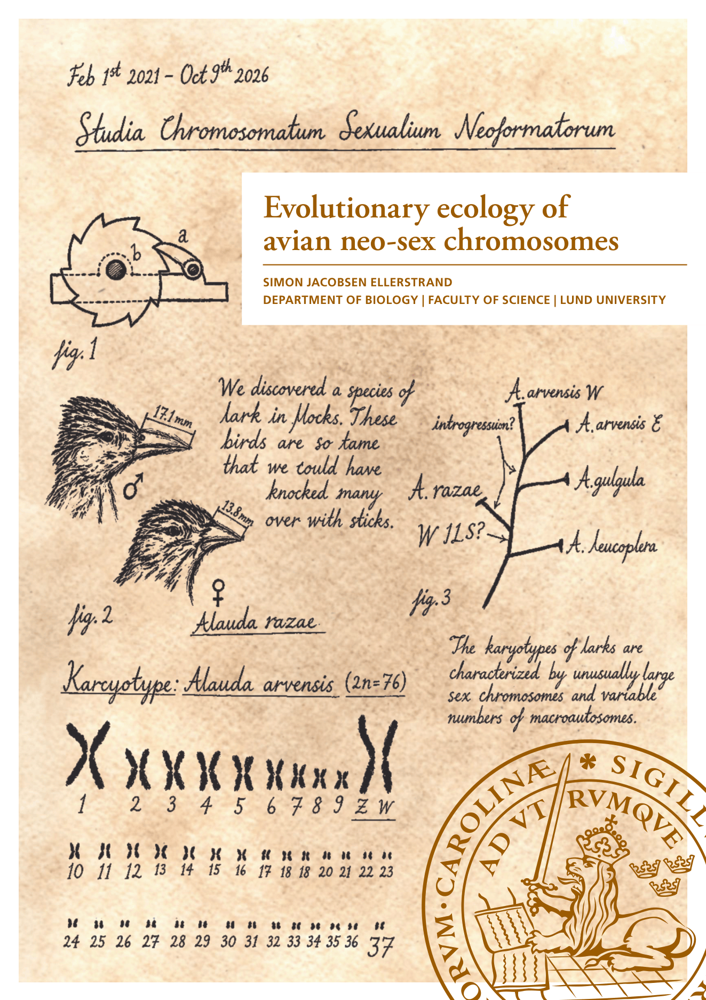

## Evolutionary ecology of avian neo-sex chromosomes

 

This repository contains supplementary material and high quality images for my PhD thesis "Evolutionary ecology of avian neo-sex chromosomes". The thesis (excluding manuscripts) can be found at:

https://www.lunduniversity.lu.se/publication/429c8c15-a79e-4336-a706-dd9a25d18de5

### List of Papers:
#### Paper I
Ellerstrand, S.J., Churcher, A., Kutschera, V.E., Hansson, B., 2026. PhaseWY: A pipeline for haplotype phasing, sex chromosome
identification and extraction of sex-limited sequences. bioRxiv preprint. https://doi.org/10.64898/2026.06.17.732863

#### Paper II
Ellerstrand, S.J., Hansson, B., 2026. Selective regimes and evolutionary dynamics of Z and W gametologs across an expanded avian neo-sex chromosome. Genome Biology and Evolution, 18(8), evag204. https://doi.org/10.1093/gbe/evag204

#### Paper III
Ellerstrand, S.J., Brooke, M. de L., Kutschera, V.E., Hansson, B., 2026. An enlarged neo-W chromosome maintains female functional genetic variation in the critically endangered Raso lark. Submitted to Molecular Ecology.

#### Paper IV
Ellerstrand, S.J., Alström, P., Hansson, B., 2026. Dynamics of enlarged neo-sex chromosomes during speciation of Alauda larks. Manuscript.

#### Paper V
Brown, T.J., Ellerstrand, S.J., Sigeman, H., Melo, M., Lundberg, M., Hansson, B., 2026. Unique sex chromosome translocations and evolutionary strata in two Sylvioidea songbird families. BMC Genomics, 27, 401. https://doi.org/10.1186/s12864-026-12861-1

#### Paper VI
Ellerstrand, S.J., Proux-Wéra, E., Gallard, S., Fu, Y., Alström, P., Hansson, B., 2026. Sex chromosome evolution predicts sexual dimorphism and life-history outcomes across larks. Manuscript.

